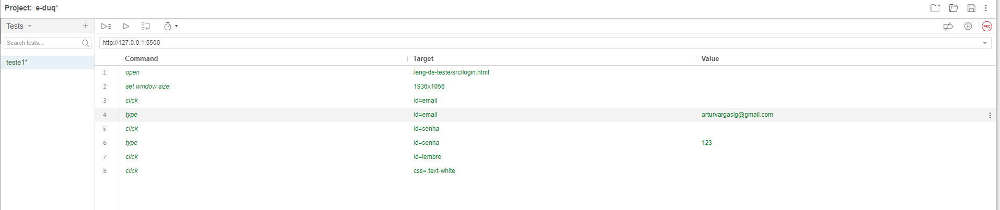
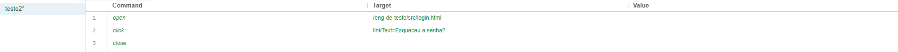
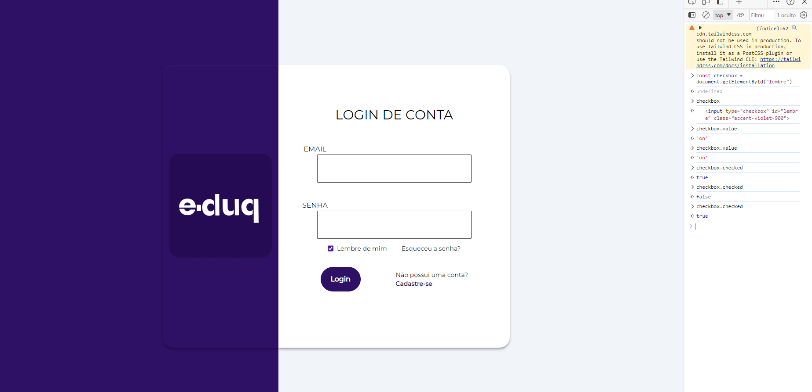

## 1. Introdução
- **Nome do projeto:** E-DUQ - Tela 2/2
- **Versão do software:** 0.0.8
- **Data do teste:** 26/02/24
- **Testadores:** Artur Vargas
- **Objetivo do teste:** Validação de informações dos campos de login para o login de usuário.

## 2. Escopo do Teste
- **Funcionalidades testadas:** Inputs de <i>Email, Senha</i> e também <i>checkbox "Lembre de mim"</i>
- **Navegadores e dispositivos testados:** Microsoft Edge
- **Ambiente de teste:** Selenium IDE

## 3. Resumo dos Resultados
- **Número de testes realizados:** 3
- **Número de testes com falha:** 0
- **Número de bugs encontrados:** 0
- **Gravidade dos bugs encontrados:** Nenhuma

## 4. Detalhes dos Testes
- **Teste 1:**
  - **Descrição do teste:** Validação de informações colocadas nos campos de login
  - **Resultado esperado:** Logar usuário, levando-o para a página principal do site
  - **Resultado obtido:** Usuário logado
  - **Status (passou/falhou):** Passou
  - **Evidências (capturas de tela, logs, etc.):** 
     
  - **Observações:** O bom resultado dos testes acontecem devido a colocação de atributos nas tags HTML onde evitam erros.
  
   Por exemplo: 
  ```
    <input type="email"/> 
  ```

  - **Teste 2:**
  - **Descrição do teste:** Testar link "Esqueceu a senha?"
  - **Resultado esperado:** Direcionamento para página de recuperamento de senha ao clicar em "Esqueceu a senha?"
  - **Resultado obtido:** Abrir página esqueceusenha.html
  - **Status (passou/falhou):** Passou
  - **Evidências (capturas de tela, logs, etc.):** 
     
  - **Observações:** A página "esqueceusenha.html" ainda não foi criada.

- **Teste 3:**
  - **Descrição do teste:** Testar funcionamento do checkbox "Lembre de mim"
  - **Resultado esperado:** Navegador guardar informação true ou false da checkbox.
  - **Resultado obtido:** Ainda é preciso criar um script para guardar as informações.

   Por exemplo: 
  ```
        document.addEventListener('DOMContentLoaded', function() {
        var lembrarChecado = localStorage.getItem('lembrarChecado') === 'true';
        var lembrarCheckbox = document.getElementById('lembrar');
        var usuarioInput = document.getElementById('usuario');

        if (lembrarChecado) {
            lembrarCheckbox.checked = true;
            usuarioInput.value = localStorage.getItem('nomeUsuario');
        }

        document.getElementById('loginForm').addEventListener('submit', function(event) {
            if (lembrarCheckbox.checked) {
            localStorage.setItem('nomeUsuario', usuarioInput.value);
            localStorage.setItem('lembrarChecado', true);
            } else {
            localStorage.removeItem('nomeUsuario');
            localStorage.removeItem('lembrarChecado');
            }
        });
        });
 
  ```

  - **Status (passou/falhou):** Em andamento
  - **Evidências (capturas de tela, logs, etc.):** 
     
  - **Observações:** Com o script o objetivo funciona corretamente.

## 5. Conclusões
- **Resumo dos resultados do teste:** Todos estão funcionando corretamente na questão do front-end
- **Recomendações para correções de bugs:** Não houve bugs
- **Riscos e problemas identificados:** Nenhum 
- **Próximos passos:** Fazer merge com o back-end

<!-- ## 6. Apêndices
- **Lista completa de bugs encontrados:** Não houve bugs
- **Logs de teste:** [Inserir logs de teste]
- **Capturas de tela e outras evidências:** [Inserir capturas de tela e outras evidências]
- **Observações:** [Inserir observações adicionais] -->
